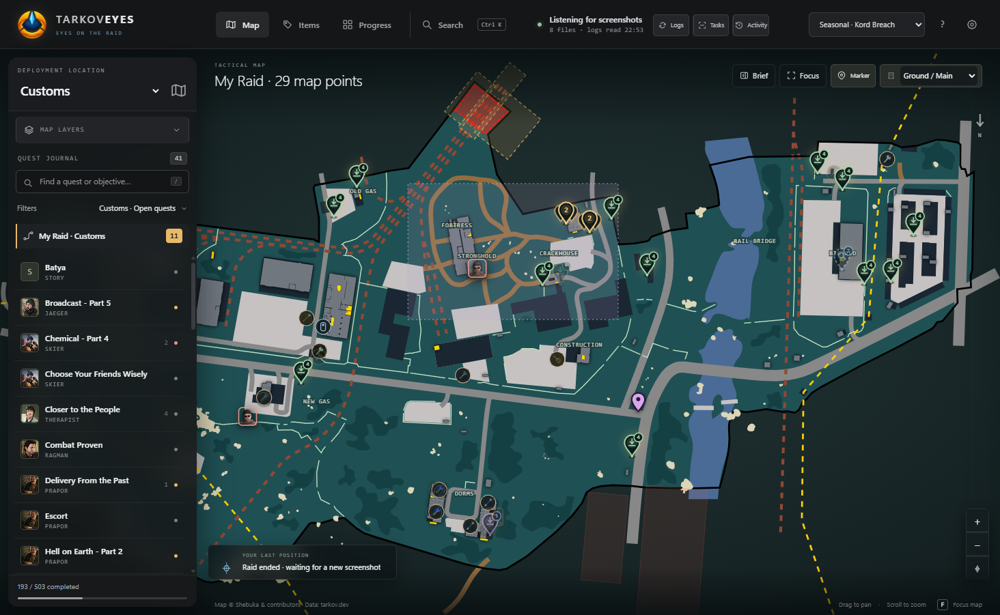
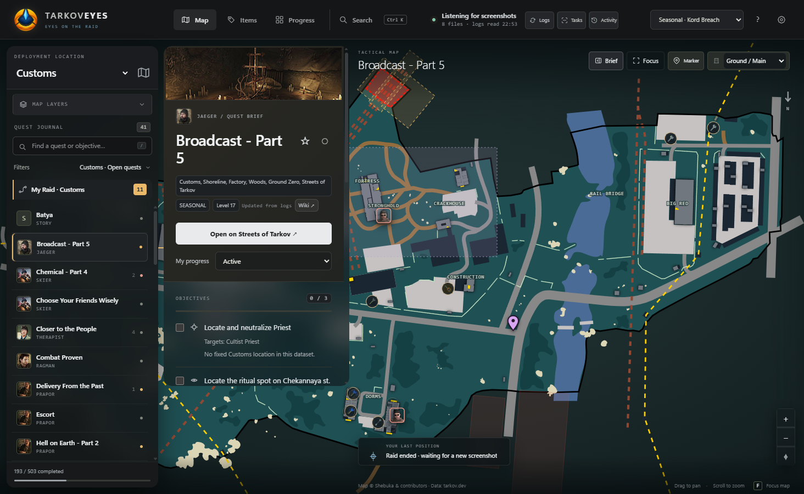
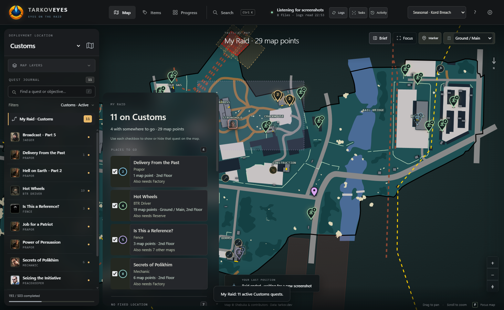
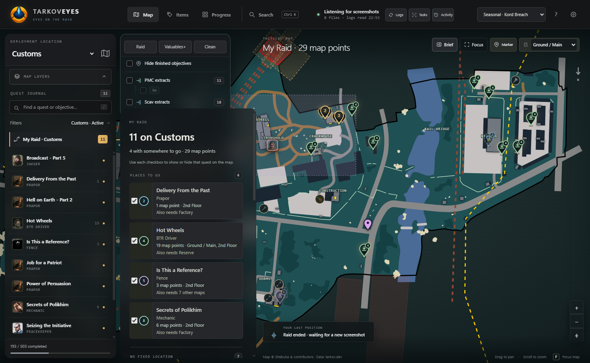
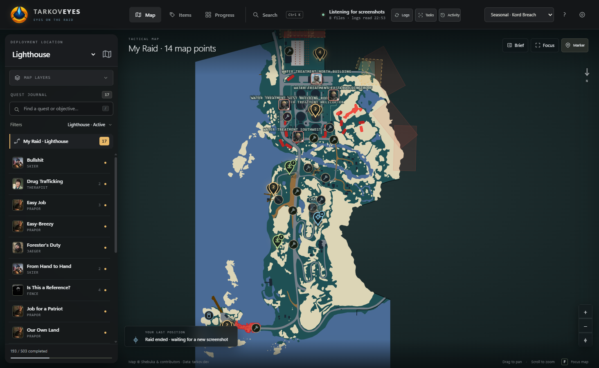
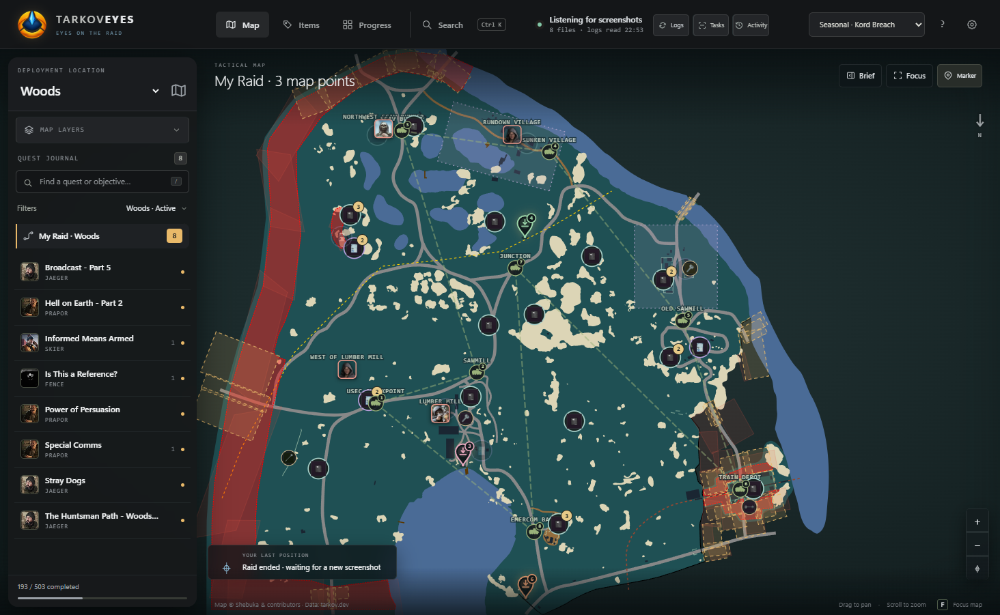
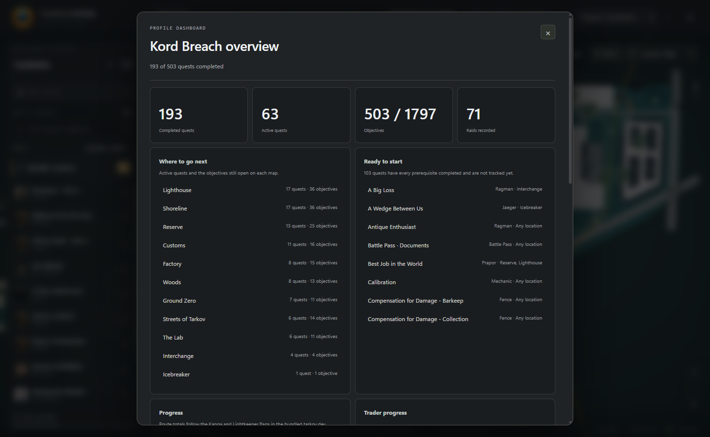
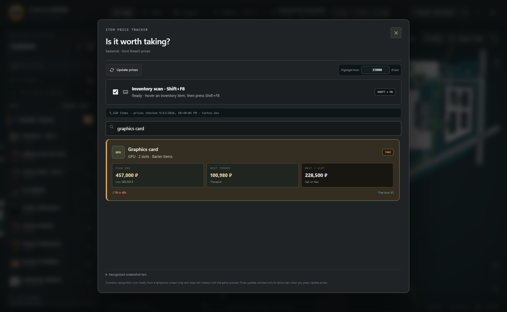

# TarkovEyes

A local Windows companion for Escape from Tarkov. Interactive tactical maps for
all 13 locations, the full quest catalogue with your own progress on it, quest
status read from the game's own logs, your position from screenshot filenames,
local OCR for the Tasks screen and for hovered items, loot and hazard layers,
personal markers, raid history and a Battle Pass tracker.

Everything runs on this machine. It reads game files; it never writes them.

> **Not affiliated with Battlestate Games.** No endorsement, and no guarantee
> against sanctions. It reads screenshots and logs the game has already written
> to disk — it does not touch the game process. See
> [What it will never do](#what-it-will-never-do).



---

## Contents

- [Install and run](#install-and-run)
- [What it does](#what-it-does)
- [Keyboard](#keyboard)
- [What it will never do](#what-it-will-never-do)
- [What is bundled](#what-is-bundled)
- [How it works](#how-it-works)
- [Working on it](#working-on-it)
- [Licensing](#licensing)
- [Known limits](#known-limits)

---

## Install and run

**Windows only.** The app reads the Windows install's screenshot and log
folders, and the packaged build is a Windows portable executable.

This repository holds the **source**, not a build — `App/` is not tracked. So
you build it once, and after that you launch it like any other program.

```bash
git clone https://github.com/MelGP/tarkoveyes.git
cd tarkoveyes/src
npm install
npm start
```

That is the whole thing. `npm start` opens the window straight from source.

What to expect, measured on a clean clone:

| step | what happens |
| --- | --- |
| `npm install` | 27 packages, a couple of seconds |
| first `npm start` | Electron downloads its own binary (~200 MB), once |
| `node_modules` after that | about 445 MB |
| the window | opens on the Seasonal profile with all 13 maps loaded |

You need **Node.js** and **git**. Verified on Node 24.16 with npm 11.13; any
recent Node 20+ should be fine. No admin rights, and nothing is installed
system-wide — delete the folder and it is gone.

### A portable copy you can double-click

`npm start` is the developer path. To get the standalone application:

```bash
npm run package
```

That writes `src/dist/TarkovEyes-win32-x64/` with `TarkovEyes.exe` inside — 1,963
files — plus a SHA-256 manifest of every one of them. Copy that folder anywhere
and run the `.exe`; no Node.js is needed on that machine. Keep the folder
together, moving the `.exe` on its own will not work.

It will tell you that `rcedit` is not installed and that the executable keeps
Electron's default icon. That is not a failure — the build is complete and
works. Stamping the app's own icon into the executable needs a Windows resource
editor, so if you want it:

```bash
npm i -D rcedit
npm run package
```

The packager says what it could not do rather than shipping the wrong icon
silently.

Both ways read and write the **same** save folder,
`%APPDATA%\TarkovEyes\local-data`, so your progress follows you between them.

### First run

Once, whichever way you started it:

1. **Pick your profile** — top right: `PvP`, `PvE` or `Seasonal · Kord Breach`.
   Progress is kept separately for each, so nothing bleeds between them.
2. **Open Connection** (the gear, top right) and choose your Tarkov
   **Screenshots** folder.
3. Optionally choose the **Logs** folder as well. This is what lets the app
   follow your raid and read quest status.
4. Press **Save connection**. Screenshots already in the folder are skipped, so
   you do not get a flood of old positions.
5. In game, bind a **Screenshot** key under Controls if you have not already.

From then on: take a screenshot in raid and your position appears on the map.
The app reads the *filename*, which already contains the coordinates — it never
looks at the image.

### Upgrading from a Raid Notes install

The application was called **Raid Notes** until September 2026, and the old name
survived on disk for a while after that because `%APPDATA%\RaidNotes` held the
only copy of the real profile. It does not any more: nothing you can see or
click says Raid Notes.

If you are coming from an older build, the first launch **moves your save for
you**. It copies `%APPDATA%\RaidNotes\local-data` to
`%APPDATA%\TarkovEyes\local-data`, and only when the new folder does not exist
yet, so a later launch can never overwrite live data with a stale copy. It
copies rather than moves, so the old folder stays exactly where it was as a way
back — delete it once you are satisfied.

Only `local-data` comes across. The rest of that folder is Chromium's own cache
and is rebuilt on demand; carrying it over would import staleness, not history.

Exported backups now carry a `tarkoveyes-backup` marker instead of
`raid-notes-backup`. Nothing reads it — importing parses the file and normalises
it — so backups written by older builds still import unchanged.

---

## What it does

### Quests, on the map, with your own progress

503 quests in the Seasonal catalogue, 518 in PvP, 515 in PvE. The rail on the
left is the journal; picking a row opens the brief as a card beside it, level
with the row you clicked.



Each objective is a **pin standing on its coordinate**, and the head of the pin
says what you do there rather than repeating a number:

| glyph | verb | what it means |
| --- | --- | --- |
| magnifier | find | search this spot for an item |
| eye | visit | go and look, carry nothing |
| shelf arrow | plant | leave something behind |
| beacon | mark | place a marker or a jammer |
| crosshair | shoot | something to kill here |
| starburst | signal | fire a signal flare |
| extract arrow | extract | leave the raid here |
| tick | done | already finished |

The same glyph sits beside the objective in the brief, so the map and the list
teach each other. A *possible* location is drawn with a broken outline; a
finished objective goes green and quiet, and can be hidden entirely.

The brief also names the key you need, the items to bring, what unlocks the
quest and what it unlocks, the whole chain in both directions, and a button
that jumps to another map when the objective is not here.

### My Raid — what to actually do this run



One button answers "what am I doing this raid". It splits into **places to go**
and **no fixed location**, because on most maps well over half of your active
quests are kill counts and hand-ins with nothing to walk to — real work, but
not map work.

A quest whose remaining objectives all live on this map is flagged **CAN FINISH
HERE**. One that does not says what else it needs: two maps by name, more than
that as a count.

### Layers



Extracts and transits, BTR stops and their route, 329 locked doors with the key
each one wants, 39 switches with the chain they operate spelled out, boss spawn
zones wearing the boss's face with the spawn chance for *your* game mode,
landmark labels, loot by category, Battle Pass documents, and your own markers.

Presets — **Raid**, **Valuables+**, **Clean** — switch the lot at once.

When everything is on, a single map can carry more than two hundred markers.
They are ranked against each other so that two markers never overlap: the
quest objective you opened the map for wins, and the loose screwdriver behind
it steps aside. Zoom in and it comes back on its own.

### Hazard zones



683 bundled hazard polygons: 577 minefields, 69 sniper zones, 18 mortar zones
and 19 Labyrinth traps. Minefields are drawn one polygon per mine, so the
density is what makes the band read.

### Battle Pass documents



375 possible document spawns across 12 maps, from Perofunyang's community map,
each with a photograph of the exact spot and an English note.

**These positions are approximate and the app says so.** The source uses image
coordinates rather than game-world ones, so the marker gets you to the room and
the photograph gets you to the shelf.

### Progress



Completed, active, objectives and raids at a glance; where to go next, ranked
by how much is open on each map; which quests every prerequisite is already
satisfied for, so a trader is holding them for you right now; Kappa and
Lightkeeper routes; trader-by-trader progress; and raid statistics.

Every progress bar is a button that opens the set of quests it measures, as a
tree from the quests that start a route to the one that ends it.

### Is it worth taking?



Search any of 5,320 items for flea price, best trader and value per slot.

Better, in raid: hover an item and press **Shift+F8**. The app takes a small
temporary crop of the screen around your cursor, reads the label locally, and
shows the price in a small overlay near the pointer. No Inspect, no alt-tab.

It reads the tile label under the cursor, weighted by distance, and falls back
to comparing the tile's colours against a small bundled signature when the text
comes back mangled — which on a raid inventory it often does.

### Reading the Tasks screen

Take a screenshot of your in-game Tasks list and press **Tasks**. The app reads
the quest names and offers to mark them active. Every match is reviewed before
anything is saved.

This exists because there is no way to ask the game what you have taken on. See
[Known limits](#known-limits).

---

## Keyboard

| key | does |
| --- | --- |
| `Ctrl+K` | quick find — quest, map, landmark, extract, marker, loot, item |
| `/` | jump to the quest search box |
| `F` | focus the map to the whole window |
| `↑` `↓` | move through the quest list |
| `Esc` | close one thing at a time |
| `Shift+F8` | price the item under the cursor, anywhere, including in game |

---

## What it will never do

This is the line the whole project keeps, and it is why the app is built the
way it is:

- **No game memory is read.** Ever.
- **Nothing is injected** into the game, and no game file is modified.
- **No input is synthesised** and the mouse is not hooked.
- **Position comes from screenshot filenames**, which already contain the
  coordinates. Image pixels are only ever read for an OCR action you asked for.
- The renderer is hardened: no Node integration, context isolation on, sandbox
  on, navigation and renderer network requests denied.
- **The only network call is to `json.tarkov.dev`**, for item prices — once
  about a second and a half after the window opens, and whenever you press
  Update prices. It is skipped if the catalogue is under an hour old, and it
  fails silently rather than interrupting you.

Everything else is local and offline.

---

## What is bundled

Nothing is fetched while you play. All of it ships with the app:

| | |
| --- | --- |
| Maps | 13, as vector artwork with selectable floors |
| Quests | 518 PvP / 515 PvE / 492 Seasonal, with pictures |
| Points of interest | 9,632 across all maps |
| — extracts and transits | 132 + 27 |
| — locked doors | 329, each resolved to the key it wants |
| — switches | 39, with what they operate |
| — boss spawn zones | 128, over 18 bosses |
| — hazard zones | 683 |
| — BTR stops | 14 |
| Keys | 197 with their own item images |
| Traders | 11 with portraits |
| Items | 5,320 with prices and colour signatures |
| Battle Pass | 375 spawns, 461 offline maps and photographs |
| OCR | Tesseract with bundled English data |

---

## How it works

```text
tarkov/
├─ App/          the built application you launch (not in git)
├─ src/          the source
└─ screenshots/  the images in this file
```

Inside `src/` there are three source areas, and the line between them is real:

```text
main/         the Electron main process — the only code that touches the OS
  main.js       the entry point; the window, the IPC handlers, the observer
  catalogs.js   quest and item catalogues, and the one outbound request
  item-hotkey.js  Shift+F8: capture, read, rank by name then by artwork
  ocr.js        the local Tesseract worker
  paths.js      where the bundled assets are — a leaf, imported by the others
  preload.cjs   the narrow context-isolated bridge to the renderer

lib/          no Electron, no DOM, nothing imported from either — unit-tested
  core.js       store, screenshot and log parsing, the observer
  items.js      item catalogue and OCR matching
  imaging.js    crop preparation before OCR
  appearance.js per-item colour signatures
  templates.js  item artwork templates

app/          the renderer
  index.html    the shell
  app.js        the entry; boot, and what is left after the split
  css/          eight stylesheets whose ORDER is the cascade
  ...           22 more modules, one per thing the application does
  data/ assets/ maps, catalogues, artwork, pictures

test/         the Node suite
licenses/     upstream licences and data-source records
tools/
  build/      generate bundled data and assets from what is here
  update/     refresh bundled data from tarkov.dev
  dev/        harnesses, the preview server, inspection; ship nothing
  release/    build a portable app, sync a built copy beside src/
  sources/    pinned upstream inputs — parsed, never executed
```

`lib/` is separate because those five modules import nothing at all, not even
each other, so they can be tested directly. Importing anything from `main/`
starts Electron, which is why none of it is unit-tested and all of it is
covered by the checks that drive the running application instead.

The renderer is plain HTML, CSS and JavaScript. No framework, no bundler, no
build step for the UI.

`main/` owns everything native — the file watchers, the OCR, the screen capture
for `Shift+F8`, the one outbound request — and the renderer reaches it only
through the small `window.companion` bridge in `main/preload.cjs`. Anything new
that needs the operating system goes through a validated IPC handler and that
bridge; Node APIs are never exposed to the page.

`main/` and `lib/` are copied into a build as whole directories, so a new
module in either ships without anyone having to list it anywhere.

Progress lives in `%APPDATA%\TarkovEyes\local-data\progress.json`, isolated per
profile, with import, export and recovery from a damaged file.

---

## Working on it

```bash
cd src
npm test             # the Node suite — 67 tests
npm start            # run the source version under Electron
npm run preview      # serve the renderer at http://127.0.0.1:4318/
npm run package      # build a portable app into src/dist/
```

Edit in `src/` and `npm start` picks it up on the next launch. That is the whole
loop for a cloned checkout.

```bash
npm run sync:check   # would the installed copy change?
npm run sync         # update ../App/ and its checksum manifest
```

Those two are for a workspace that also keeps a **built** `App/` beside `src/`
and launches that rather than `npm start` — they copy the changed runtime files
into `App/resources/app` and update the SHA-256 manifest. A fresh clone has no
`App/`, so they have nothing to do until you make one with `npm run package`.

The preview at `http://127.0.0.1:4318/` serves the renderer in a normal browser.
It is much faster to iterate in, but it has no Electron bridge, so folder
watching, OCR, desktop capture and real saving do not exist there — `app.js`
falls back to `localStorage` so the rest of the UI still works.

Two console harnesses cover what the Node suite cannot, because it never
renders anything. Serve the preview, or drive the installed application over
`--remote-debugging-port=9222`, and evaluate:

- `tools/dev/renderer-smoke.js` — drives the real UI across all 13 maps, floor
  switching, the quest brief, My Raid, the dashboard, quick find and the layers,
  printing one line per check.
- `tools/dev/style-snapshot.js` — records computed styles before and after a
  change and names every element that moved.

**Run one harness at a time.** Two suites driving the same application look
exactly like a real map-loading bug.

The stylesheets in `app/css/` are deliberately not Prettier-formatted; the
project formats JavaScript only. Their **order in `index.html` is the
cascade** - later rules are meant to win - so a correction belongs in a later
file rather than edited into an earlier one, and reordering the links is a
silent restyling of the whole application. A test asserts the order.

---

## Licensing

The project's own code is MIT — [`src/LICENSE`](src/LICENSE).

**The bundled data and artwork are not.** Map artwork is by Shebuka and the
tarkov-dev-svg-maps contributors under their own attribution and noncommercial
terms. The Battle Pass locations and photographs are Perofunyang's, CC BY-NC
4.0. Quest, item, map, POI and loot metadata and the game artwork that comes
with them are from [tarkov.dev](https://tarkov.dev). OCR is Tesseract.js.

Full attribution is in [`src/THIRD-PARTY.md`](src/THIRD-PARTY.md) and
[`src/licenses/`](src/licenses).

**Keep this personal and noncommercial.** Redistributing the bundled artwork is
a separate question from the code licence, and the answer to it is not MIT.

---

## Known limits

Things that were investigated and genuinely cannot be done, so nobody spends a
second evening on them:

- **The game does not tell you which quests you have taken.** Status comes from
  log lines, so a quest accepted before the app was installed, or in a session
  whose logs have rotated away, is invisible. The Tasks screenshot scan and the
  "Available now" filter exist to close that gap. Of 503 quests in this profile,
  245 are simply untracked.
- **A raid's outcome is not in the logs.** Across 132 log folders the only
  recorded match statuses describe the match slot, not whether you survived. So
  there is no survival rate, and the Progress panel says so rather than leaving
  a suspicious gap.
- **Trader loyalty and player level are in no file the app can read.** A quest
  can have every prerequisite satisfied and still sit behind LL3. "Available
  now" is a derivation from prerequisites, never a claim about your traders.
- **Battle Pass positions are approximate.** The community source has no
  game-world coordinates. Use the photograph for the exact spot.
- **Some quest ids in old logs match no published catalogue.** They are event
  quests from earlier game versions; tarkov.dev only publishes what the current
  build carries. The Activity card names the trader and the date rather than
  guessing a name.
